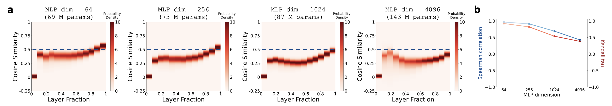
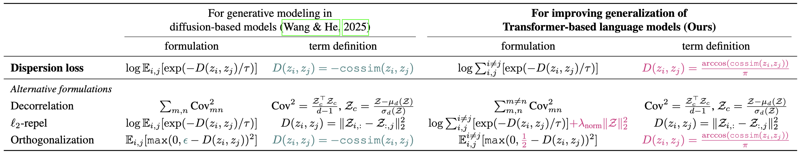

<div align="center">

  <h1><code>LM-Dispersion</code></h1>

  [](https://arxiv.org/abs/2602.00217)
  [](https://arxiv.org/pdf/2602.00217)
  [](https://chenliu-1996.github.io/projects/LM-Dispersion/)
  [](https://openreview.net/pdf?id=pd6A7jB5D6)
  [](https://openreview.net/forum?id=pd6A7jB5D6)
  [](https://github.com/KrishnaswamyLab/LM-Dispersion)
  <br>[](https://www.linkedin.com/in/chenliu1996/)
  [](https://www.linkedin.com/in/xingzhi-sun)
  [](https://www.linkedin.com/in/xi-xiao-4800272a5)
  [](https://www.linkedin.com/in/alexandre-van-tassel)
  [](https://scholar.google.com/citations?user=3rDjnykAAAAJ&sortby=pubdate)
  <br>[](https://x.com/ChenLiu_1996)
  [](https://x.com/https://x.com/XingzhiSun)
  [](https://x.com/markshawww99)
  [](https://x.com/KrishnaswamyLab)

</div>

### Krishnaswamy Lab, Yale University

This is the official repository for the ICML 2026 paper
<br>[Dispersion loss counteracts embedding condensation and improves generalization in small language models](https://arxiv.org/pdf/2602.00217).

Please raise issues [here](https://github.com/ChenLiu-1996/LM-Dispersion).


## A 5-minute intro to this paper
**This paper presents an observation-driven improvement on language model training.** 

We observe a geometric phenomenon which we term **embedding condensation**, where token embeddings collapse into a narrow cone-like subspace in smaller language models. We then design a training objective called dispersion loss to counteract the effect.


**Takeaway 1**: Larger model, less condensation.
<br>Within the same model family, smaller models exhibit more severe embedding condensation, with token embeddings collapsing toward near-parallel directions, while larger models resist this collapse.


To isolate the effect of model size from other confounding factors, we conduct a controlled experiment where we pre-train GPT2-like models, varying only the MLP dimension while keeping all other components fixed, including the number of layers, embedding dimension, dataset, and training settings. The same phenomenon is observed.



**Takeaway 2**: Condensation occurs early on.
<br>The embedding condensation phenomenon emerges at model initialization and is gradually mitigated, not exacerbated, by pre-training.


**Takeaway 3**: Distillation is not a solution.
<br>Knowledge distillation from a larger model does not transfer the desired resistance to embedding condensation.


**Dispersion loss**
<br>Embedding condensation reduces the expressivity of Transformers by collapsing token embedding vectors into narrow cones, under-utilizing the representation space. We hypothesize that by dispersing embeddings during training, smaller models can achieve representational qualities more similar to larger models, thus narrowing the performance gap without increasing the number of parameters.


Our dispersion loss is inspired by the "[diffuse and disperse](https://arxiv.org/abs/2506.09027)" paper with practical modifications.



Dispersion loss counteracts the embedding condensation effect during mid-training and pre-training. A qualitative result is shown below, while more quantitative results can be found in the paper.


## Citation
```bibtex
@inproceedings{liu2026dispersion,
  title={Dispersion loss counteracts embedding condensation and improves generalization in small language models},
  author={Liu, Chen and Sun, Xingzhi and Xiao, Xi and Van Tassel, Alexandre and Xu, Ke and Reimann, Kristof and Liao, Danqi and Gerstein, Mark and Wang, Tianyang and Wang, Xiao and Krishnaswamy, Smita},
  booktitle={International conference on machine learning},
  year={2026},
  organization={PMLR}
}
```

## Reproduce our main observations on embedding condensation

Under `key_observations`.

1. Compute the embeddings.
```bash
# NOTE: Some runs do not have `--gpu` because that would lead to CUDA OOM on my device. If your device allows, you can turn on the `--gpu` flag.
python compute_embedding_cossim.py --model-id gpt2 --gpu && \
python compute_embedding_cossim.py --model-id gpt2-medium --gpu && \
python compute_embedding_cossim.py --model-id gpt2-large --gpu && \
python compute_embedding_cossim.py --model-id gpt2-xl --gpu

python compute_embedding_cossim.py --model-id Qwen/Qwen-1_8B --gpu && \
python compute_embedding_cossim.py --model-id Qwen/Qwen-7B --gpu && \
python compute_embedding_cossim.py --model-id Qwen/Qwen-14B && \
python compute_embedding_cossim.py --model-id Qwen/Qwen-72B

python compute_embedding_cossim.py --model-id Qwen/Qwen2.5-0.5B --gpu && \
python compute_embedding_cossim.py --model-id Qwen/Qwen2.5-1.5B --gpu && \
python compute_embedding_cossim.py --model-id Qwen/Qwen2.5-3B --gpu && \
python compute_embedding_cossim.py --model-id Qwen/Qwen2.5-7B --gpu && \
python compute_embedding_cossim.py --model-id Qwen/Qwen2.5-14B --gpu && \
python compute_embedding_cossim.py --model-id Qwen/Qwen2.5-32B --gpu && \
python compute_embedding_cossim.py --model-id Qwen/Qwen2.5-72B --gpu

python compute_embedding_cossim.py --model-id Qwen/Qwen3-0.6B --gpu && \
python compute_embedding_cossim.py --model-id Qwen/Qwen3-1.7B --gpu && \
python compute_embedding_cossim.py --model-id Qwen/Qwen3-4B --gpu && \
python compute_embedding_cossim.py --model-id Qwen/Qwen3-8B --gpu && \
python compute_embedding_cossim.py --model-id Qwen/Qwen3-14B --gpu && \
python compute_embedding_cossim.py --model-id Qwen/Qwen3-32B --gpu

python compute_embedding_cossim.py --model-id bigscience/bloom-560m --gpu && \
python compute_embedding_cossim.py --model-id bigscience/bloom-1b1 --gpu && \
python compute_embedding_cossim.py --model-id bigscience/bloom-1b7 --gpu && \
python compute_embedding_cossim.py --model-id bigscience/bloom-3b --gpu && \
python compute_embedding_cossim.py --model-id bigscience/bloom-7b1 --gpu

python compute_embedding_cossim.py --model-id deepseek-ai/DeepSeek-R1-Distill-Qwen-1.5B --gpu && \
python compute_embedding_cossim.py --model-id deepseek-ai/DeepSeek-R1-Distill-Qwen-7B --gpu && \
python compute_embedding_cossim.py --model-id deepseek-ai/DeepSeek-R1-Distill-Qwen-14B --gpu && \
python compute_embedding_cossim.py --model-id deepseek-ai/DeepSeek-R1-Distill-Qwen-32B --gpu
```

2. Plot the embeddings
```bash
python plot_trend.py --model-id gpt2 gpt2-medium gpt2-large gpt2-xl --model-family gpt2
python plot_trend.py --model-id Qwen-Qwen-1_8B Qwen-Qwen-7B Qwen-Qwen-14B Qwen-Qwen-72B --model-family Qwen1
python plot_trend.py --model-id Qwen-Qwen2.5-0.5B Qwen-Qwen2.5-1.5B Qwen-Qwen2.5-3B Qwen-Qwen2.5-7B Qwen-Qwen2.5-14B Qwen-Qwen2.5-32B Qwen-Qwen2.5-72B --model-family Qwen2.5
python plot_trend.py --model-id Qwen-Qwen3-0.6B Qwen-Qwen3-1.7B Qwen-Qwen3-4B Qwen-Qwen3-8B Qwen-Qwen3-14B Qwen-Qwen3-32B --model-family Qwen3
python plot_trend.py --model-id bigscience-bloom-560m bigscience-bloom-1b1 bigscience-bloom-1b7 bigscience-bloom-3b bigscience-bloom-7b1 --model-family bloom
python plot_trend.py --paired --model-id Qwen-Qwen2.5-Math-1.5B Qwen-Qwen2.5-Math-7B Qwen-Qwen2.5-14B Qwen-Qwen2.5-32B deepseek-ai-DeepSeek-R1-Distill-Qwen-1.5B deepseek-ai-DeepSeek-R1-Distill-Qwen-7B deepseek-ai-DeepSeek-R1-Distill-Qwen-14B deepseek-ai-DeepSeek-R1-Distill-Qwen-32B --model-family Qwen2.5-distill
```

3. Try different metrics.
```bash
python plot_trend.py --model-id gpt2 gpt2-medium gpt2-large gpt2-xl --model-family gpt2 --last-n
```

4. Try different input datasets.
```bash
python compute_embedding_cossim.py --model-id gpt2 --gpu --dataset pubmed && \
python compute_embedding_cossim.py --model-id gpt2-medium --gpu --dataset pubmed && \
python compute_embedding_cossim.py --model-id gpt2-large --gpu --dataset pubmed && \
python compute_embedding_cossim.py --model-id gpt2-xl --gpu --dataset pubmed

python compute_embedding_cossim.py --model-id gpt2 --gpu --dataset imdb && \
python compute_embedding_cossim.py --model-id gpt2-medium --gpu --dataset imdb && \
python compute_embedding_cossim.py --model-id gpt2-large --gpu --dataset imdb && \
python compute_embedding_cossim.py --model-id gpt2-xl --gpu --dataset imdb

python compute_embedding_cossim.py --model-id gpt2 --gpu --dataset squad && \
python compute_embedding_cossim.py --model-id gpt2-medium --gpu --dataset squad && \
python compute_embedding_cossim.py --model-id gpt2-large --gpu --dataset squad && \
python compute_embedding_cossim.py --model-id gpt2-xl --gpu --dataset squad

python plot_trend.py --model-id gpt2 gpt2-medium gpt2-large gpt2-xl --model-family gpt2 --dataset pubmed
python plot_trend.py --model-id gpt2 gpt2-medium gpt2-large gpt2-xl --model-family gpt2 --dataset imdb
python plot_trend.py --model-id gpt2 gpt2-medium gpt2-large gpt2-xl --model-family gpt2 --dataset squad
```

## Mid-training experiments
For example, under `LM_dispersion/midtrain_gpt2_huggingface`.

1. Default loss
    ```bash
    accelerate launch midtrain_gpt2.py --lr 5e-5 --train_tokens 200_000_000 --hf_token $HUGGINGFACE_ACCESS_TOKEN --cache_dir $SCRATCH_DIR --seed $SEED --per_device_train_batch_size 32 --gradient_accumulation_steps 4
    ```

2. Dispersion loss
    ```bash
    accelerate launch midtrain_gpt2.py --lr 5e-5 --train_tokens 200_000_000 --dispersion 'angular_spread' --dispersion_loc 'all' --dispersion_coeff 0.1 --hf_token $HUGGINGFACE_ACCESS_TOKEN --cache_dir $SCRATCH_DIR --seed $SEED --per_device_train_batch_size 32 --gradient_accumulation_steps 4
    ```

3. Baseline methods
    ```bash
    launch midtrain_gpt2_other_counter_condensation.py --lr 5e-5 --train_tokens 200_000_000 --noisy_embedding --hf_token $HUGGINGFACE_ACCESS_TOKEN --cache_dir $SCRATCH_DIR --seed $SEED --per_device_train_batch_size 32 --gradient_accumulation_steps 4

    launch midtrain_gpt2_other_counter_condensation.py --lr 5e-5 --train_tokens 200_000_000 --active_forgetting --hf_token $HUGGINGFACE_ACCESS_TOKEN --cache_dir $SCRATCH_DIR --seed $SEED --per_device_train_batch_size 32 --gradient_accumulation_steps 4
    ```

## Pre-training experiments
We used Torch Titan to perform the pre-training. See [this repository](https://github.com/xingzhis/torchtitan).


## Dependencies
We developed the codebase in a miniconda environment.
How we created the conda environment:
```
# Optional: Update to libmamba solver.
conda update -n base conda
conda install -n base conda-libmamba-solver
conda config --set solver libmamba

conda create --name dispersion pytorch==2.1.0 torchvision torchaudio pytorch-cuda=12.1 -c pytorch -c nvidia -c anaconda -c conda-forge -y
conda activate dispersion
conda install scikit-learn scikit-image pandas matplotlib seaborn tqdm -c pytorch -c anaconda -c conda-forge -y

python -m pip install webdataset einops open-clip-torch
python -m pip install git+https://github.com/openai/CLIP.git
python -m pip install diffusers["torch"]==0.21.4 transformers huggingface_hub==0.25.2
python -m pip install datasets sentencepiece
python -m pip install numpy==1.26
python -m pip install nltk

python -m pip install -U phate
python -m pip install trl bitsandbytes
python -m pip install "transformers==4.46.0"
python -m pip install -U transformers accelerate
python -m pip install lm-eval
```

## Debug
If you receive this error:
```bash
libstdc++.so.6: version `GLIBCXX_3.4.29' not found
```

You can run:
```bash
export LD_LIBRARY_PATH=$CONDA_PREFIX/lib:$LD_LIBRARY_PATH
```
